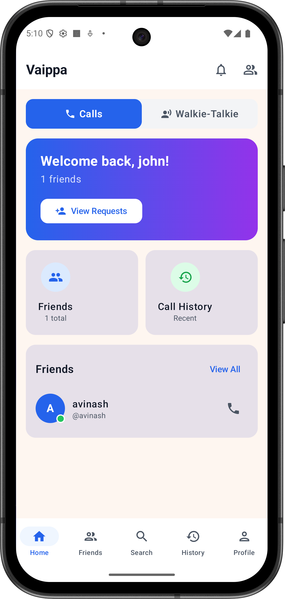
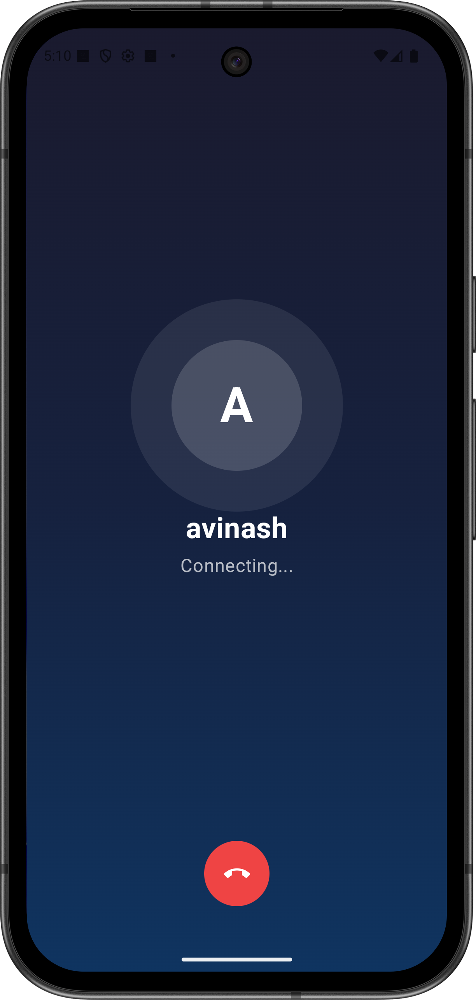
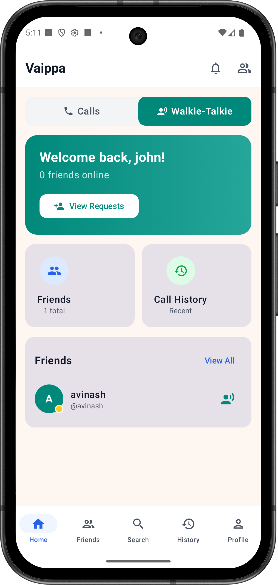
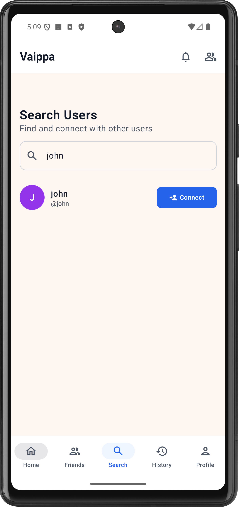

# Vaippa

Peer-to-peer audio calling and walkie-talkie app for Android, built with Jetpack Compose, WebRTC, and Firebase.

<p align="center">
  
  
  
</p>

## Features

### Voice Calls
- One-to-one audio calls over WebRTC
- Real-time call signaling via Firebase Firestore
- Incoming call notification bar (works from any screen)
- Mute, speaker toggle, and call duration timer
- Call feedback after each call
- Call history with filtering

<p align="center">
  
</p>

### Walkie-Talkie (Push-to-Talk)
- Hold-to-talk instant audio streaming to friends
- Persistent WebRTC connections (no call setup needed)
- DataChannel for low-latency talk state signaling
- Auto-connects when both users are online
- Auto-reconnects on network drops with exponential backoff
- Speaker-first audio routing

<p align="center">
  
</p>

### Friends & Connections
- Search users and send friend requests
- Accept or reject incoming requests
- Duplicate request prevention (checks both directions)
- Real-time online/offline/in-call status indicators

<p align="center">
  
</p>

### Other
- Firebase Anonymous Auth with unique username registration
- Home screen mode toggle (Calls / Walkie-Talkie) -- both stay active in background
- Foreground services keep calls and walkie-talkie alive when screen is locked
- FCM push notifications (Cloud Functions ready, requires Firebase Blaze plan)
- In-app notification system
- Offline friends cache via Room database
- User profiles with edit support
- Settings, about, help, privacy policy, and terms of service screens

## Tech Stack

| Layer | Technology |
|-------|-----------|
| UI | Jetpack Compose + Material 3 |
| Architecture | MVVM + Clean Architecture |
| DI | Hilt (Multibinding for pluggable features) |
| Audio | WebRTC via `io.getstream:stream-webrtc-android` |
| Auth | Firebase Anonymous Auth |
| Database | Firebase Firestore (remote) + Room (local cache) |
| Notifications | Firebase Cloud Messaging |
| Language | Kotlin 2.0.21 |
| Build | Gradle KTS, KSP, compileSdk 36, minSdk 24 |

## Architecture

```
:app                   App shell, navigation, auth/main/settings UI
:core                  Shared infrastructure (WebRTC, Firebase, Room, models, DI)
:feature-call          Voice call feature (CallManager, CallScreen, signaling)
:feature-walkietalkie  Walkie-talkie feature (WalkieTalkieManager, PTT, DataChannel)
```

Features are fully pluggable -- remove a module dependency from `app/build.gradle.kts` to exclude a feature entirely. The remaining features continue to work independently.

```
:app --> :core
:app --> :feature-call --> :core
:app --> :feature-walkietalkie --> :core
```

## Setup

1. Clone the repository
2. Create a Firebase project and add an Android app with package name `avinash.app.audiocallapp`
3. Download `google-services.json` and place it in `app/`
4. Add your debug SHA-1 fingerprint in Firebase Console (Project Settings > Your Apps > Add Fingerprint)
5. (Optional) Configure TURN servers for reliable connectivity across restrictive networks. Add to `local.properties`:
   ```properties
   TURN_SERVER=your-turn-server.com
   TURN_USERNAME=your-username
   TURN_PASSWORD=your-password
   ```
6. Build and run

## License

All rights reserved.
